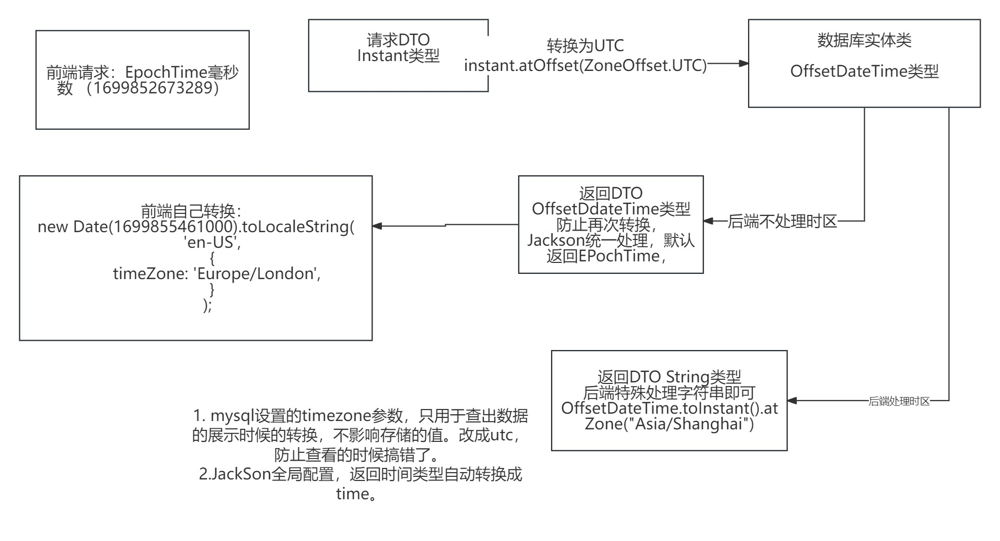

## 数据库迁移管理

# database first

维护sql文件，每一个sql文件唯一不能更改，只能append新的sql文件修改，文件以00000_detail.
sql命名，保证顺序唯一。启动服务时候，liquibase自动同步sql文件到数据库。（包括测试库）

这样保证：数据库修改来源唯一，可以追溯记录，可以回滚。

## 集成测试

1. 使用相同的数据库（以后换成testContainer）
2. 启动时候同步数据库结构
3. 每个测试时候在beforeEach时候清空对应表数据

## dto最佳实践

1. 每个接口应该有对应的dto，定义有语义的后缀而不是Dto后缀（Request，Response），create和update的request
   payload可以考虑共用，把id放到path里。
2. 不可变的：private final Type xxxx;
3. 使用lombok的builder可以方便测试快速创建对象，但是要搭配@Jacksonized
4. 嵌套的对象需要手动加valid验证

## entity最佳实践

1. 按需集成audit类，拥有创建时间，创建人，修改时间，修改人等属性
2. 添加Version注解实现乐观锁

        @Version 
        private Long version 
3. 属性需要添加校验的注解（notBlank，size等），可以获取更清晰的错误信息。
4. 时间类型设置为 `Instant`

## MapStruct

1. 自定义转换方法
   需要手动转换的，可以在接口里定义default方法，mapstruct会把这些方法的参数类型和目标类型对应到：源类的类型和目标类的类型去自动执行

   default Set<Tag> TagIdToTags(Set<Integer> tags) {
   Set<Tag> ans = new HashSet<>();
   for (Integer tagId : tags) {
   Tag tag = new Tag();
   tag.setId(tagId);
   ans.add(tag);
   }
   return ans;
   }

   default Set<Integer> TagsToTagId(Set<Tag> tags) {
   Set<Integer> ans = new HashSet<>();
   for (Tag tag : tags) {
   ans.add(tag.getId());
   }
   return ans;
   }

# jpa entityManger session JpaRepository关系

jpa和entityManger是标准，session是hibernate对entityManger的实现，JpaRepository是spring
对jpa的抽象

# 时区，时间

      SET GLOBAL time_zone = '+0:00';
